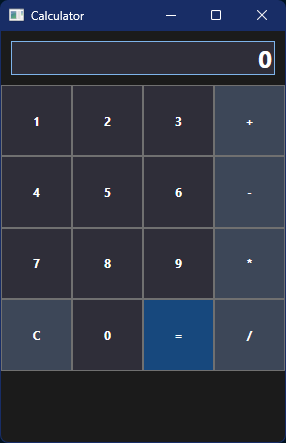

# Практична робота 1 - Калькулятор

## Код файлу MainWindow.xaml

```xml
<Window x:Class="Practical_1.MainWindow"
        xmlns="http://schemas.microsoft.com/winfx/2006/xaml/presentation"
        xmlns:x="http://schemas.microsoft.com/winfx/2006/xaml"
        xmlns:d="http://schemas.microsoft.com/expression/blend/2008"
        xmlns:mc="http://schemas.openxmlformats.org/markup-compatibility/2006"
        xmlns:local="clr-namespace:Practical_1"
        mc:Ignorable="d"
        Title="Calculator" Height="450" Width="300">
    <Grid Background="#1b1b1b">
        <Grid.RowDefinitions>
            <RowDefinition Height="Auto"/>
            <RowDefinition Height="*"/>
        </Grid.RowDefinitions>

        <TextBox x:Name="Display" Grid.Row="0" Text="0" HorizontalAlignment="Stretch" VerticalAlignment="Stretch" Background="#2f2e39" Foreground="#FFFFFFFF" FontWeight="Bold"
                 TextAlignment="Right" FontSize="24" Margin="10"/>

        <Grid Grid.Row="1">
            <Grid.RowDefinitions>
                <RowDefinition/>
                <RowDefinition/>
                <RowDefinition/>
                <RowDefinition/>
                <RowDefinition/>
            </Grid.RowDefinitions>
            <Grid.ColumnDefinitions>
                <ColumnDefinition/>
                <ColumnDefinition/>
                <ColumnDefinition/>
                <ColumnDefinition/>
            </Grid.ColumnDefinitions>

            <Button Background="#2f2e39" Foreground="#FFFFFFFF" FontWeight="Bold" Grid.Row="0" Grid.Column="0" Content="1" Click="Number_Click"/>
            <Button Background="#2f2e39" Foreground="#FFFFFFFF" FontWeight="Bold" Grid.Row="0" Grid.Column="1" Content="2" Click="Number_Click"/>
            <Button Background="#2f2e39" Foreground="#FFFFFFFF" FontWeight="Bold" Grid.Row="0" Grid.Column="2" Content="3" Click="Number_Click"/>
            <Button Background="#3d4758" Foreground="#FFFFFFFF" FontWeight="Bold" Grid.Row="0" Grid.Column="3" Content="+" Click="Operator_Click"/>

            <Button Background="#2f2e39" Foreground="#FFFFFFFF" FontWeight="Bold" Grid.Row="1" Grid.Column="0" Content="4" Click="Number_Click"/>
            <Button Background="#2f2e39" Foreground="#FFFFFFFF" FontWeight="Bold" Grid.Row="1" Grid.Column="1" Content="5" Click="Number_Click"/>
            <Button Background="#2f2e39" Foreground="#FFFFFFFF" FontWeight="Bold" Grid.Row="1" Grid.Column="2" Content="6" Click="Number_Click"/>
            <Button Background="#3d4758" Foreground="#FFFFFFFF" FontWeight="Bold" Grid.Row="1" Grid.Column="3" Content="-" Click="Operator_Click"/>

            <Button Background="#2f2e39" Foreground="#FFFFFFFF" FontWeight="Bold" Grid.Row="2" Grid.Column="0" Content="7" Click="Number_Click"/>
            <Button Background="#2f2e39" Foreground="#FFFFFFFF" FontWeight="Bold" Grid.Row="2" Grid.Column="1" Content="8" Click="Number_Click"/>
            <Button Background="#2f2e39" Foreground="#FFFFFFFF" FontWeight="Bold" Grid.Row="2" Grid.Column="2" Content="9" Click="Number_Click"/>
            <Button Background="#3d4758" Foreground="#FFFFFFFF" FontWeight="Bold" Grid.Row="2" Grid.Column="3" Content="*" Click="Operator_Click"/>

            <Button Background="#3d4758" Foreground="#FFFFFFFF" FontWeight="Bold" Grid.Row="3" Grid.Column="0" Content="C" Click="Clear_Click"/>
            <Button Background="#2f2e39" Foreground="#FFFFFFFF" FontWeight="Bold" Grid.Row="3" Grid.Column="1" Content="0" Click="Number_Click"/>
            <Button Background="#17487d" Foreground="#FFFFFFFF" FontWeight="Bold" Grid.Row="3" Grid.Column="2" Content="=" Click="Equals_Click"/>
            <Button Background="#3d4758" Foreground="#FFFFFFFF" FontWeight="Bold" Grid.Row="3" Grid.Column="3" Content="/" Click="Operator_Click"/>
        </Grid>
    </Grid>
</Window>
```

## Код файлу MainWindow.xaml.cs

```cs
using System;
using System.Windows;
using System.Windows.Controls;

namespace Practical_1
{
    public partial class MainWindow : Window
    {
        private string currentOperator = "";
        private double result = 0;
        private bool isNewNumber = true;

        public MainWindow()
        {
            InitializeComponent();
        }

    private void Number_Click(object sender, RoutedEventArgs e)
    {
        if (sender is Button button)
        {
            if (isNewNumber)
            {
                Display.Text = "";
                isNewNumber = false;
            }

            Display.Text += button.Content.ToString();
        }
    }

    private void Operator_Click(object sender, RoutedEventArgs e)
    {
        if (sender is Button button)
        {
            currentOperator = button.Content.ToString();
            result = double.Parse(Display.Text);
            isNewNumber = true;
        }
    }

        private void Clear_Click(object sender, RoutedEventArgs e)
        {
            Display.Text = "0";
            currentOperator = "";
            result = 0;
            isNewNumber = true;
        }

        private void Equals_Click(object sender, RoutedEventArgs e)
        {
            double secondOperand = double.Parse(Display.Text);
            switch (currentOperator)
            {
                case "+":
                    result += secondOperand;
                    break;
                case "-":
                    result -= secondOperand;
                    break;
                case "*":
                    result *= secondOperand;
                    break;
                case "/":
                    if (secondOperand != 0)
                        result /= secondOperand;
                    else
                        MessageBox.Show("Cannot divide by zero!");
                    break;
            }
            Display.Text = result.ToString();
            isNewNumber = true;
        }
    }
}

```

## Фото програми


