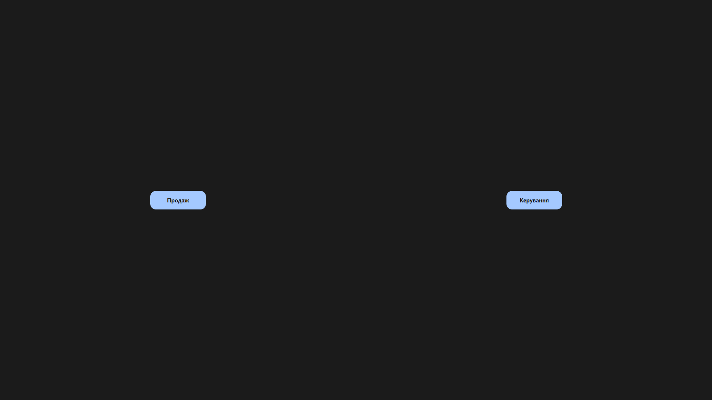
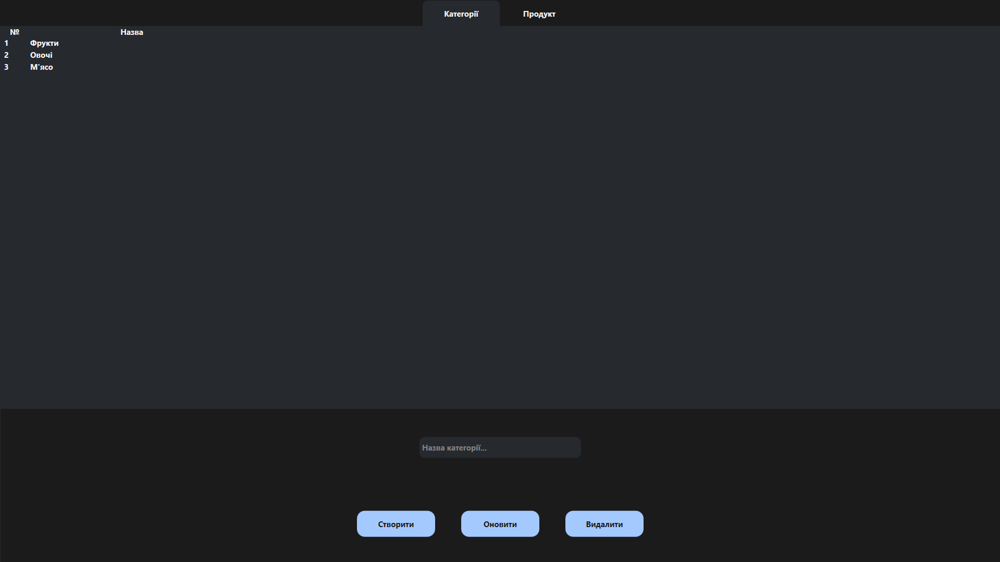
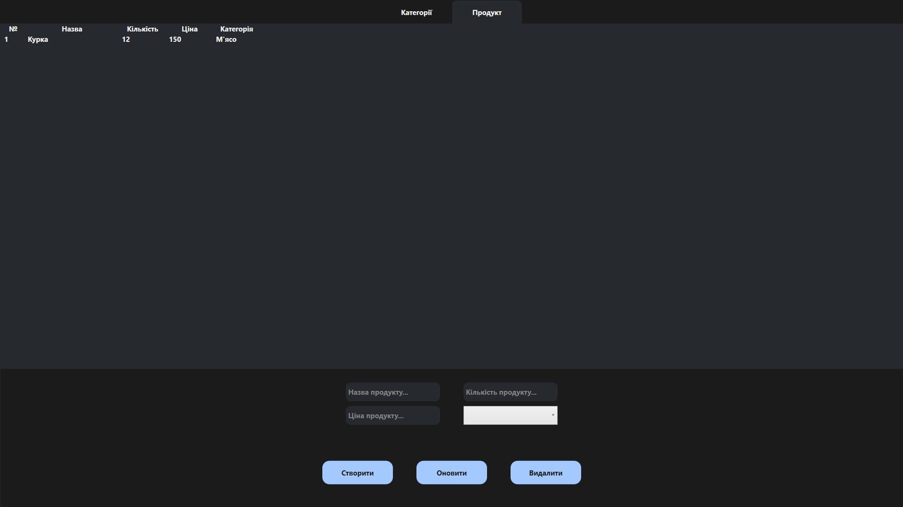
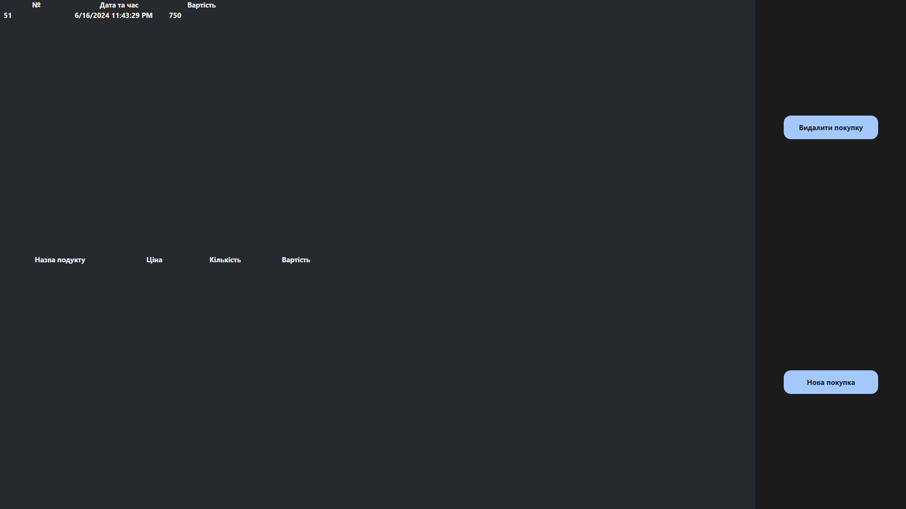
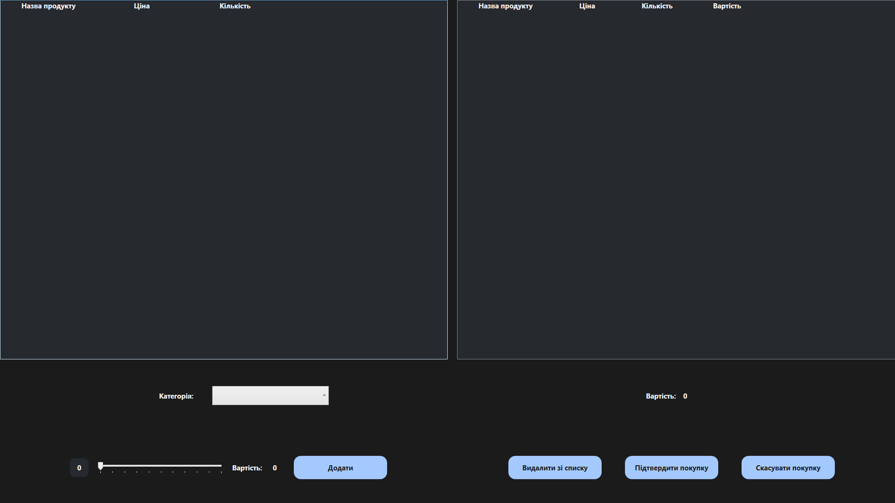

# Практична робота №4 - Створення АІС "Магазин"

## Тема і завдання

Створити застосунок для обліку товарів магазину.

## Виконавець

Любченко Олег

## Виконання завдання

### Код програми

Створюємо файл проект .NET WPF та пишемо код програми.

MainWindow.xaml

```xml
<Window x:Class="PR_Store.MainWindow"
        xmlns="http://schemas.microsoft.com/winfx/2006/xaml/presentation"
        xmlns:x="http://schemas.microsoft.com/winfx/2006/xaml"
        xmlns:d="http://schemas.microsoft.com/expression/blend/2008"
        xmlns:mc="http://schemas.openxmlformats.org/markup-compatibility/2006"
        xmlns:local="clr-namespace:PR_Store"
        mc:Ignorable="d"
        Title="Store" WindowState="Maximized" WindowStyle="None" FontWeight="Bold"  FontSize="15">
    <Grid Background="#1b1b1b">
        <Grid.ColumnDefinitions>
            <ColumnDefinition Width="*"/>
            <ColumnDefinition Width="*"/>
        </Grid.ColumnDefinitions>
        <Button Content="Продаж" BorderThickness="0" Grid.Column="0" VerticalAlignment="Center" Height="50" Width="150" Background="#a4c9ff" Foreground="#1b1b1b" Click="Button_Click_1">
            <Button.Resources>
                <Style TargetType="Border">
                    <Setter Property="CornerRadius" Value="25"/>
                </Style>
            </Button.Resources>
            <Button.Style>
                <Style TargetType="Button">
                    <Setter Property="Template">
                        <Setter.Value>
                            <ControlTemplate TargetType="Button">
                                <Border Name="border" Background="{TemplateBinding Background}" BorderBrush="{TemplateBinding BorderBrush}" BorderThickness="{TemplateBinding BorderThickness}" CornerRadius="{TemplateBinding Border.CornerRadius}">
                                    <ContentPresenter HorizontalAlignment="Center" VerticalAlignment="Center"/>
                                </Border>
                                <ControlTemplate.Triggers>
                                    <Trigger Property="IsMouseOver" Value="True">
                                        <Trigger.EnterActions>
                                            <BeginStoryboard>
                                                <Storyboard>
                                                    <ColorAnimation
                                                        Storyboard.TargetName="border"
                                                        Storyboard.TargetProperty="(Border.Background).(SolidColorBrush.Color)"
                                                        To="#728cb2" Duration="0:0:0.3"/>
                                                </Storyboard>
                                            </BeginStoryboard>
                                        </Trigger.EnterActions>
                                        <Trigger.ExitActions>
                                            <BeginStoryboard>
                                                <Storyboard>
                                                    <ColorAnimation
                                                        Storyboard.TargetName="border"
                                                        Storyboard.TargetProperty="(Border.Background).(SolidColorBrush.Color)"
                                                        To="#a4c9ff" Duration="0:0:0.3"/>
                                                </Storyboard>
                                            </BeginStoryboard>
                                        </Trigger.ExitActions>
                                    </Trigger>
                                </ControlTemplate.Triggers>
                            </ControlTemplate>
                        </Setter.Value>
                    </Setter>
                    <Setter Property="Background" Value="#26292e"/>
                    <Setter Property="Foreground" Value="#a4c9ff"/>
                    <Setter Property="Border.CornerRadius" Value="15"/>
                </Style>
            </Button.Style>
        </Button>
        <Button Content="Керування" BorderThickness="0" Grid.Column="1" VerticalAlignment="Center" Height="50" Width="150" Background="#a4c9ff" Foreground="#1b1b1b" Click="Button_Click">
            <Button.Resources>
                <Style TargetType="Border">
                    <Setter Property="CornerRadius" Value="25"/>
                </Style>
            </Button.Resources>
            <Button.Style>
                <Style TargetType="Button">
                    <Setter Property="Template">
                        <Setter.Value>
                            <ControlTemplate TargetType="Button">
                                <Border Name="border" Background="{TemplateBinding Background}" BorderBrush="{TemplateBinding BorderBrush}" BorderThickness="{TemplateBinding BorderThickness}" CornerRadius="{TemplateBinding Border.CornerRadius}">
                                    <ContentPresenter HorizontalAlignment="Center" VerticalAlignment="Center"/>
                                </Border>
                                <ControlTemplate.Triggers>
                                    <Trigger Property="IsMouseOver" Value="True">
                                        <Trigger.EnterActions>
                                            <BeginStoryboard>
                                                <Storyboard>
                                                    <ColorAnimation
                                                        Storyboard.TargetName="border"
                                                        Storyboard.TargetProperty="(Border.Background).(SolidColorBrush.Color)"
                                                        To="#728cb2" Duration="0:0:0.3"/>
                                                </Storyboard>
                                            </BeginStoryboard>
                                        </Trigger.EnterActions>
                                        <Trigger.ExitActions>
                                            <BeginStoryboard>
                                                <Storyboard>
                                                    <ColorAnimation
                                                        Storyboard.TargetName="border"
                                                        Storyboard.TargetProperty="(Border.Background).(SolidColorBrush.Color)"
                                                        To="#a4c9ff" Duration="0:0:0.3"/>
                                                </Storyboard>
                                            </BeginStoryboard>
                                        </Trigger.ExitActions>
                                    </Trigger>
                                </ControlTemplate.Triggers>
                            </ControlTemplate>
                        </Setter.Value>
                    </Setter>
                    <Setter Property="Background" Value="#26292e"/>
                    <Setter Property="Foreground" Value="#a4c9ff"/>
                    <Setter Property="Border.CornerRadius" Value="15"/>
                </Style>
            </Button.Style>
        </Button>
    </Grid>
</Window>
```

MainWindow.xaml.cs

```cs
using System.Text;
using System.Windows;
using System.Windows.Controls;
using System.Windows.Data;
using System.Windows.Documents;
using System.Windows.Input;
using System.Windows.Media;
using System.Windows.Media.Imaging;
using System.Windows.Navigation;
using System.Windows.Shapes;

namespace PR_Store
{
    public partial class MainWindow : Window
    {
        public MainWindow()
        {
            InitializeComponent();
        }


        private void Button_Click(object sender, RoutedEventArgs e)
        {
            Manage manageWindow = new Manage();
            manageWindow.ShowDialog();
        }

        private void Button_Click_1(object sender, RoutedEventArgs e)
        {
            Sell sellWindow = new Sell();
           sellWindow.ShowDialog();
        }
    }
}
```

Інший код доступний за посиланням: https://github.com/liubquanti-edu/3-PPPC-Design-of-automated-information-systems/tree/main/Practical-3

### Перевіряємо роботу програми

Головне меню


Меню керування категоріями


Меню керування продуктами


Меню керування покупками


Меню додавання покупок
