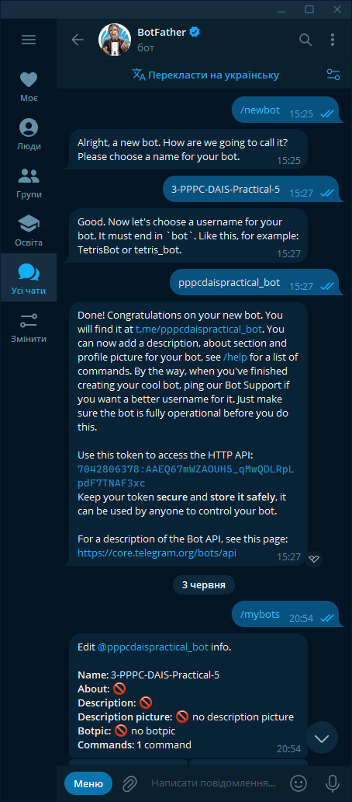
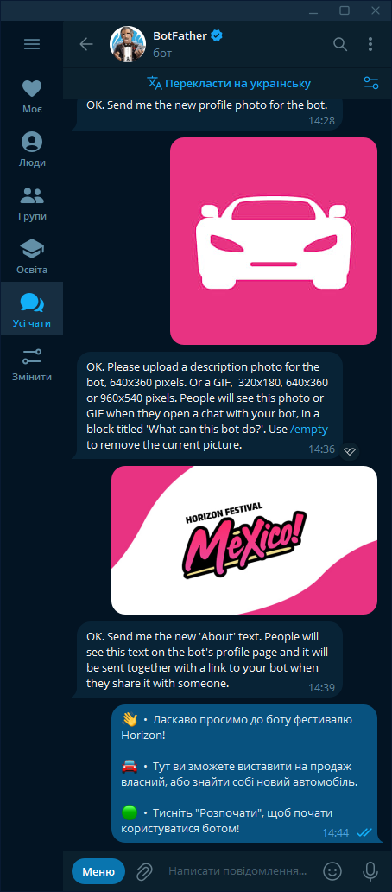
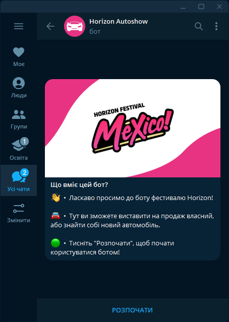
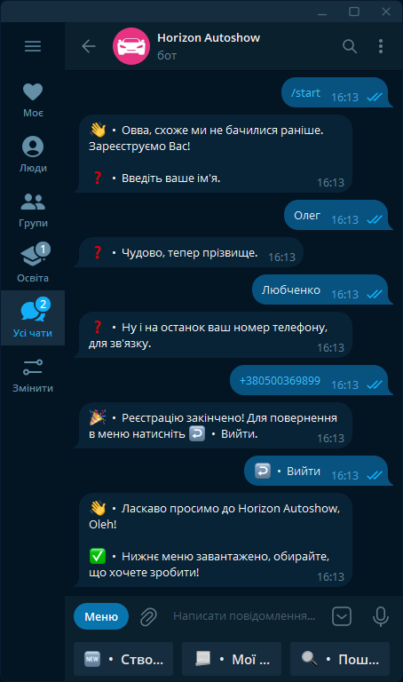
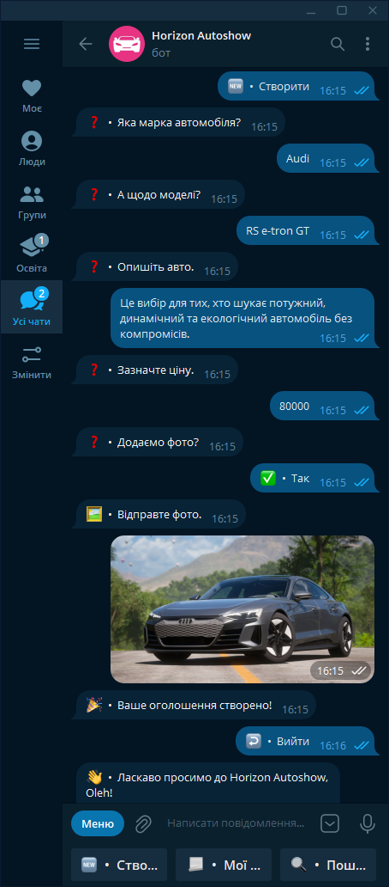
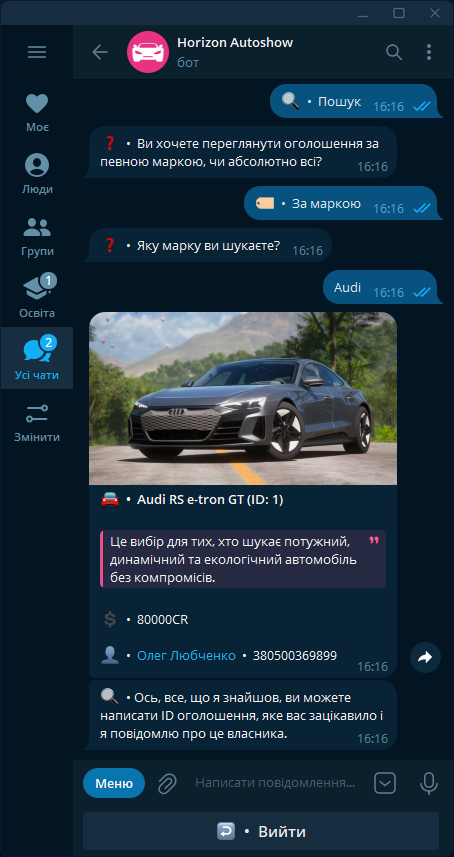
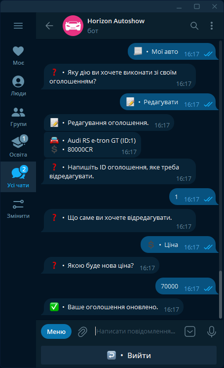
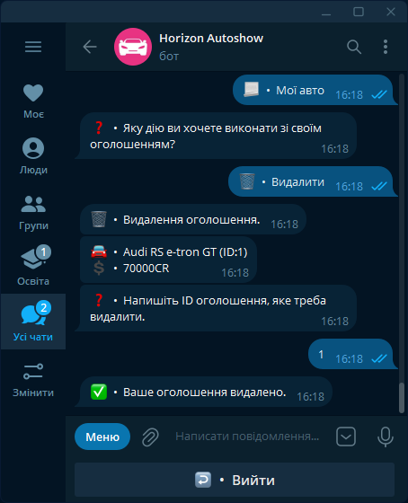
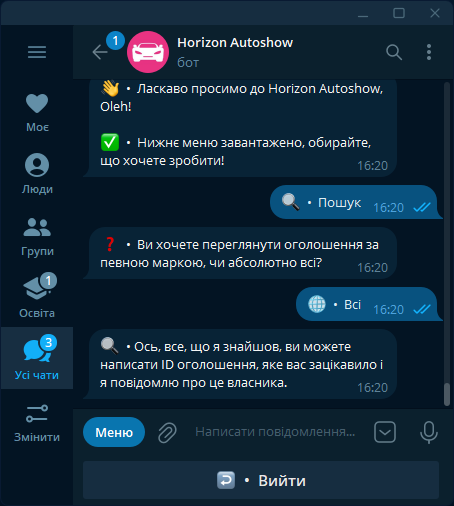

# Практична робота №4 - Telegram бот

## Тема і завдання

Створити Telegram бота для продажу та пошуку авто.

## Виконавець

Любченко Олег

## Виконання завдання

### Створення боту

Реєструємо бота та отримуємо токен.


Виконуємо оформлення боту.


### Код програми
Створюємо файл bot.py та пишемо код програми.
```python
import telebot
import config
import bot_token
import requests
import time
from lxml import html
from telebot import types
from telebot.types import InputMediaPhoto, InputMediaVideo
import sqlite3
from pathlib import Path
import io, base64
from PIL import Image
import os
import shutil
import base64

Reg_User = {
    1:{'id', 'name', 'surname', 'phone', 'tag'}
}
Reg_Avto={
    1:{'user_id', 'brand', 'model', 'description', 'price'}
}
Add_photo={
    1:{'user_id', 'ad_id', 'picture'}
}
Avto={
    1:{'id', 'user_id', 'brand', 'model', 'description', 'price'}
}

conn = sqlite3.connect("./Practical-4/avto.db", check_same_thread=False)
cursor = conn.cursor()
bot = telebot.TeleBot(bot_token.TOKEN)

def get_cursor():
    conn = sqlite3.connect('./Practical-4/avto.db', check_same_thread=False)
    return conn.cursor(), conn

@bot.message_handler(commands=['start'])
def start(message):
    Reg_User[message.chat.id] = [' ', ' ', ' ', ' ', ' ']
    Reg_Avto[message.chat.id] = [' ', ' ', ' ', ' ', ' ']
    Add_photo[message.chat.id] = [' ', ' ', ' ']
    Avto[message.chat.id] = [' ', ' ', ' ', ' ', ' ', ' ']
    Reg_User[message.chat.id][0] = message.chat.id
    Reg_User[message.chat.id][4] = message.from_user.username
    Reg_Avto[message.chat.id][0] = message.chat.id
    reg = check(message.chat.id)
    if reg == 1:
        markup = types.ReplyKeyboardMarkup(one_time_keyboard=True, resize_keyboard=True)
        add_ads_button = types.KeyboardButton("🆕  •  Створити")
        my_ads_button = types.KeyboardButton("🔍  •  Пошук")
        view_ads_button = types.KeyboardButton("📃  •  Мої авто")
        markup.add(add_ads_button, view_ads_button, my_ads_button)
        message=bot.send_message(message.chat.id, "👋  •  Ласкаво просимо до Horizon Autoshow, {0.first_name}!\n\n✅  •  Нижнє меню завантажено, обирайте, що хочете зробити!"
        .format(message.from_user, bot.get_me()), parse_mode='html', reply_markup=markup)
        bot.register_next_step_handler(message, distribution)
    else:
        message = bot.send_message(message.chat.id, "👋  •  Овва, схоже ми не бачилися раніше. Зареєструємо Вас!\n\n❓  •  Введіть ваше ім'я.")
        bot.register_next_step_handler(message, reg_login)

def check(user_id):
    cursor.execute('SELECT * FROM `user_data`')
    rows = cursor.fetchall()
    empty = 0
    for row in rows:
        if row[0] == user_id:
            empty = 1
    return empty

def check_id(ad_name, user_id):
    cursor, conn = get_cursor()
    cursor.execute('SELECT id FROM avto WHERE user_id=? AND brand=?', (user_id, ad_name))
    data = cursor.fetchone()
    cursor.close()
    conn.close()
    return data[0] if data else None

def reg_login(message):
    Reg_User[message.chat.id][1] = message.text
    message = bot.send_message(message.chat.id, "❓  •  Чудово, тепер прізвище.")
    bot.register_next_step_handler(message, reg_surname)

def reg_surname(message):
    Reg_User[message.chat.id][2] = message.text
    message = bot.send_message(message.chat.id, "❓  •  Ну і на останок ваш номер телефону, для зв'язку.")
    bot.register_next_step_handler(message, reg_phone)

def reg_phone(message):
    Reg_User[message.chat.id][3] = message.text
    reg(Reg_User[message.chat.id][0], Reg_User[message.chat.id][1], Reg_User[message.chat.id][2], Reg_User[message.chat.id][3], Reg_User[message.chat.id][4])
    markup = types.ReplyKeyboardMarkup(one_time_keyboard=True, resize_keyboard=True)
    back_button = types.KeyboardButton("↩️  •  Вийти")
    markup.add(back_button)
    message = bot.send_message(message.chat.id, "🎉  •  Реєстрацію закінчено! Для повернення в меню натисніть ↩️  •  Вийти.", reply_markup=markup)
    bot.register_next_step_handler(message, start)

def reg(user_id, name, surname, phone, tag):
    cursor.execute('INSERT INTO user_data (id, name, surname, phone, tag) VALUES (?, ?, ?, ?, ?)', (user_id, name, surname, phone, tag))
    conn.commit()

def distribution(message):
    if message.text == "🆕  •  Створити":
        bot.send_message(message.chat.id, "❓  •  Яка марка автомобіля?")
        bot.register_next_step_handler(message, create_model)
    elif message.text == "🔍  •  Пошук":
        markup = types.ReplyKeyboardMarkup(one_time_keyboard=True, resize_keyboard=True)
        find_button = types.KeyboardButton("🏷️  •  За маркою")
        all_button = types.KeyboardButton("🌐  •  Всі")
        back_button = types.KeyboardButton("↩️  •  Вийти")
        markup.add(find_button, all_button, back_button)
        bot.send_message(message.chat.id, "❓  •  Ви хочете переглянути оголошення за певною маркою, чи абсолютно всі?", reply_markup=markup)
        bot.register_next_step_handler(message, view_distribution)
    elif message.text == "📃  •  Мої авто":
        markup = types.ReplyKeyboardMarkup(one_time_keyboard=True, resize_keyboard=True)
        edit = types.KeyboardButton("📝  •  Редагувати")
        delete = types.KeyboardButton("🗑️  •  Видалити")
        back_button = types.KeyboardButton("↩️  •  Вийти")
        markup.add(edit, delete, back_button)
        bot.send_message(message.chat.id, "❓  •  Яку дію ви хочете виконати зі своїм оголошенням?", reply_markup=markup)
        bot.register_next_step_handler(message, my_ad_distribution)
    else:
        markup = types.ReplyKeyboardMarkup(one_time_keyboard=True, resize_keyboard=True)
        back_button = types.KeyboardButton("↩️  •  Вийти")
        markup.add(back_button)
        bot.send_message(message.chat.id, "Для повернення в меню натисніть ↩️  •  Вийти", reply_markup=markup)
        bot.register_next_step_handler(message, start)

def view_distribution(message):
    if message.text == "🌐  •  Всі":
        view_all(message.chat.id)
        markup = types.ReplyKeyboardMarkup(one_time_keyboard=True, resize_keyboard=True)
        back_button = types.KeyboardButton("↩️  •  Вийти")
        markup.add(back_button)
        message = bot.send_message(message.chat.id, "🔍  • Ось, все, що я знайшов, ви можете написати ID оголошення, яке вас зацікавило і я повідомлю про це власника.", reply_markup=markup)
        bot.register_next_step_handler(message, view_back)

    elif message.text == "🏷️  •  За маркою":
        markup = types.ReplyKeyboardMarkup(one_time_keyboard=True, resize_keyboard=True)
        back_button = types.KeyboardButton("↩️  •  Вийти")
        markup.add(back_button)
        message = bot.send_message(message.chat.id, "❓  •  Яку марку ви шукаєте?", reply_markup=markup)
        bot.register_next_step_handler(message, view_find)

    else:
        send_answer(message.text, message.chat.id)
        markup = types.ReplyKeyboardMarkup(one_time_keyboard=True, resize_keyboard=True)
        back_button = types.KeyboardButton("↩️  •  Вийти")
        markup.add(back_button)
        message = bot.send_message(message.chat.id, "Для повернення в меню натисніть ↩️  •  Вийти", reply_markup=markup)
        bot.register_next_step_handler(message, start)

def view_find(message):
    brand = message.text
    find(message.chat.id, brand)
    markup = types.ReplyKeyboardMarkup(one_time_keyboard=True, resize_keyboard=True)
    back_button = types.KeyboardButton("↩️  •  Вийти")
    markup.add(back_button)
    message = bot.send_message(message.chat.id, "🔍  • Ось, все, що я знайшов, ви можете написати ID оголошення, яке вас зацікавило і я повідомлю про це власника.", reply_markup=markup)
    bot.register_next_step_handler(message, view_back)


def view_back(message):
    if message.text == "↩️  •  Вийти":
        start(message)  # Повернення в меню
    elif message.text.isdigit():
        ad_id = int(message.text)
        send_answer(ad_id, message.chat.id)
        markup = types.ReplyKeyboardMarkup(one_time_keyboard=True, resize_keyboard=True)
        back_button = types.KeyboardButton("↩️  •  Вийти")
        markup.add(back_button)
        bot.send_message(message.chat.id, "Для повернення в меню натисніть ↩️  •  Вийти", reply_markup=markup)
        bot.register_next_step_handler(message, start)
    else:
        bot.send_message(message.chat.id, "Будь ласка, введіть номер оголошення або натисніть ↩️  •  Вийти для повернення в меню.")
        bot.register_next_step_handler(message, view_back)

def find(user_id, brand):
    cursor.execute('SELECT * FROM avto WHERE brand = ?', (brand,))
    rows = cursor.fetchall()
    for row in rows:
        text_message = f"<strong>🚘  •  {row[2]} {row[3]} (ID: {row[0]})</strong>\n\n<blockquote>{row[4]}</blockquote>\n\n"
        
        cursor.execute('SELECT * FROM photo WHERE ad_id = ?', (row[0],))
        rows_photo = cursor.fetchall()

        text_message += "💲  •  " + str(row[5]) + "CR \n\n"
        
        cursor.execute('SELECT * FROM user_data WHERE id = ?', (row[1],))
        user = cursor.fetchone()
        if user:
            text_message += f'👤  •  <a href="https://t.me/{user[4]}">{user[1]} {user[2]}</a>  •  {user[3]}'

        photo_directory = Path(f'files/search/{user_id}')
        photo_directory.mkdir(parents=True, exist_ok=True)
        
        photos = []
        for idx, photo in enumerate(rows_photo):
            photo_path = photo_directory / f'file_{idx}.jpg'
            with open(photo_path, 'wb') as fh:
                fh.write(base64.decodebytes(photo[2].encode('utf-8')))
            photos.append(InputMediaPhoto(open(photo_path, 'rb')))
        
        if photos:
            photos[0].caption = text_message
            photos[0].parse_mode = 'HTML'
            bot.send_media_group(user_id, media=photos)
            for photo in photos:
                photo.media.close()
        else:
            bot.send_message(user_id, text=text_message, parse_mode='HTML')

        shutil.rmtree(photo_directory)

def create_model(message):
    Reg_Avto[message.chat.id][1] = message.text
    message = bot.send_message(message.chat.id, "❓  •  А щодо моделі?")
    bot.register_next_step_handler(message, create_description)

def create_description(message):
    Reg_Avto[message.chat.id][2] = message.text
    message = bot.send_message(message.chat.id, "❓  •  Опишіть авто.")
    bot.register_next_step_handler(message, create_price)

def create_price(message):
    Reg_Avto[message.chat.id][3] = message.text
    message = bot.send_message(message.chat.id, "❓  •  Зазначте ціну.")
    bot.register_next_step_handler(message, photo_question)

def create_avto(user_id, brand, model, description, price):
    cursor, conn = get_cursor()
    cursor.execute('INSERT INTO avto (user_id, brand, model, description, price) VALUES (?, ?, ?, ?, ?)', 
                   (user_id, brand, model, description, price))
    conn.commit()
    cursor.execute('SELECT last_insert_rowid()')
    ad_id = cursor.fetchone()[0]
    cursor.close()
    conn.close()
    return ad_id

def photo_question(message):
    Reg_Avto[message.chat.id][4] = message.text
    create_avto(Reg_Avto[message.chat.id][0], Reg_Avto[message.chat.id][1], Reg_Avto[message.chat.id][2], Reg_Avto[message.chat.id][3], Reg_Avto[message.chat.id][4])
    markup = types.ReplyKeyboardMarkup(one_time_keyboard=True, resize_keyboard=True)
    yes = types.KeyboardButton("✅  •  Так")
    no = types.KeyboardButton("❌  •  Ні")
    markup.add(yes, no)
    message = bot.send_message(message.chat.id, "❓  •  Додаємо фото?", reply_markup=markup)
    bot.register_next_step_handler(message, photo_distribution)

def photo_distribution(message):
    if message.text == "✅  •  Так":
        message = bot.send_message(message.chat.id, "🖼️  •  Відправте фото.")
        bot.register_next_step_handler(message, ad_photo)
    elif message.text == "❌  •  Ні":
        markup = types.ReplyKeyboardMarkup(one_time_keyboard=True, resize_keyboard=True)
        back_button = types.KeyboardButton("↩️  •  Вийти")
        markup.add(back_button)
        message = bot.send_message(message.chat.id, "🎉  •  Ваше оголошення створено!", reply_markup=markup)
        bot.register_next_step_handler(message, start)

def ad_photo(message):
    ex_counter = 0
    ad_id = check_id(ad_name=Reg_Avto[message.chat.id][1], user_id=Reg_Avto[message.chat.id][0])
    if ad_id is None:
        message = bot.send_message(message.chat.id, "⛔  •  Помилка: не вдалося знайти оголошення.")
        return

    try:
        Path(f'files/{message.chat.id}/photos').mkdir(parents=True, exist_ok=True)
        file_info = bot.get_file(message.photo[len(message.photo) - 1].file_id)
        downloaded_file = bot.download_file(file_info.file_path)
        src = f'files/{message.chat.id}/' + file_info.file_path
        with open(src, 'wb') as new_file:
            new_file.write(downloaded_file)
    except Exception as e:
        ex_counter = 1
        message = bot.send_message(message.chat.id, f"⛔  •  Фото не підходить. Помилка: {e}")
        bot.register_next_step_handler(message, ad_photo)
    
    try:
        with open(src, "rb") as image_file:
            encoded_string = base64.b64encode(image_file.read()).decode('utf-8')
        save_photo(user_id=message.chat.id, ad_id=ad_id, encoded_string=encoded_string)
        shutil.rmtree(f"files/{message.chat.id}")
    except Exception as e:
        ex_counter = 1
        message = bot.send_message(message.chat.id, f"⛔  •  Фото не вдалося зберегти, відправте його ще раз. Помилка: {e}")
        bot.register_next_step_handler(message, ad_photo)
    
    if ex_counter == 0:
        markup = types.ReplyKeyboardMarkup(one_time_keyboard=True, resize_keyboard=True)
        back_button = types.KeyboardButton("↩️  •  Вийти")
        markup.add(back_button)
        message = bot.send_message(message.chat.id, "🎉  •  Ваше оголошення створено!", reply_markup=markup)
        bot.register_next_step_handler(message, start)

def save_photo(user_id, ad_id, encoded_string):
    cursor, conn = get_cursor()
    cursor.execute('INSERT INTO photo(user_id, ad_id, picture) VALUES (?, ?, ?)', 
                   (user_id, ad_id, encoded_string))
    conn.commit()
    cursor.close()
    conn.close()

def my_ad_distribution(message):
    if message.text == "📝  •  Редагувати":
        bot.send_message(message.chat.id, "📝  •  Редагування оголошення.")
        my_avto(message.chat.id)
        markup = types.ReplyKeyboardMarkup(one_time_keyboard=True, resize_keyboard=True)
        back_button = types.KeyboardButton("↩️  •  Вийти")
        markup.add(back_button)
        message = bot.send_message(message.chat.id, "❓  •  Напишіть ID оголошення, яке треба відредагувати.", reply_markup=markup)
        bot.register_next_step_handler(message, edit_distribution)

    elif message.text == "🗑️  •  Видалити":
        bot.send_message(message.chat.id, "🗑️  •  Видалення оголошення.")
        my_avto(message.chat.id)
        markup = types.ReplyKeyboardMarkup(one_time_keyboard=True, resize_keyboard=True)
        back_button = types.KeyboardButton("↩️  •  Вийти")
        markup.add(back_button)
        message = bot.send_message(message.chat.id, "❓  •  Напишіть ID оголошення, яке треба видалити.", reply_markup=markup)
        bot.register_next_step_handler(message, delete_question)

    elif message.text == "↩️  •  Вийти":
        markup = types.ReplyKeyboardMarkup(one_time_keyboard=True, resize_keyboard=True)
        back_button = types.KeyboardButton("↩️  •  Вийти")
        markup.add(back_button)
        message = bot.send_message(message.chat.id, "Для повернення в меню натисніть ↩️  •  Вийти", reply_markup=markup)
        bot.register_next_step_handler(message, start)

def my_avto(id):
    cursor.execute('SELECT * FROM avto')
    rows = cursor.fetchall()
    for row in rows:
        if row[1] == id:
            text = "🚘  •  " + str(row[2]) + " " + str(row[3]) + " (ID:" + str(row[0]) + ")" + "\n💲  •  " + str(row[5]) + "CR"
            bot.send_message(id, text)

def delete_avto(avto, id):
    cursor.execute('SELECT * FROM avto')
    cursor.execute('DELETE FROM avto WHERE id = ? AND user_id = ?', (avto, id))
    conn.commit()
    try:
        cursor.execute('SELECT * FROM `photo`')
        cursor.execute('DELETE FROM `photo` WHERE `ad_id` = ?', (str(avto)))
        conn.commit()
    except:
        i=1

def delete_question(message):
    if message.text == "↩️  •  Вийти":
        markup = types.ReplyKeyboardMarkup(one_time_keyboard=True, resize_keyboard=True)
        back_button = types.KeyboardButton("↩️  •  Вийти")
        markup.add(back_button)
        bot.send_message(message.chat.id, "Для повернення в меню натисніть ↩️  •  Вийти", reply_markup=markup)
        bot.register_next_step_handler(message, start)
    else:
        avto = message.text
        id = str(message.chat.id)
        delete_avto(avto, id)
        markup = types.ReplyKeyboardMarkup(one_time_keyboard=True, resize_keyboard=True)
        back_button = types.KeyboardButton("↩️  •  Вийти")
        markup.add(back_button)
        message = bot.send_message(message.chat.id, "✅  •  Ваше оголошення видалено.", reply_markup=markup)
        bot.register_next_step_handler(message, start)

def edit_distribution(message):
    check = check_is_your(message.text, message.chat.id)
    print(check)
    if check != 1:
        bot.send_message(message.chat.id, "⛔  •  Це не ваше оголошення!")
        my_avto(message.chat.id)
        markup = types.ReplyKeyboardMarkup(one_time_keyboard=True, resize_keyboard=True)
        back_button = types.KeyboardButton("↩️  •  Вийти")
        markup.add(back_button)
        message = bot.send_message(message.chat.id, "❓  •  Напишіть ID оголошення, яке треба відредагувати.", reply_markup=markup)
        bot.register_next_step_handler(message, start)
    else:
        Avto[message.chat.id][0] = message.text
        Avto[message.chat.id][1] = message.chat.id
        markup = types.ReplyKeyboardMarkup(one_time_keyboard=True, resize_keyboard=True)
        brand = types.KeyboardButton("🏷️  •  Бренд")
        model = types.KeyboardButton("🚘  •  Модель")
        price = types.KeyboardButton("💲  •  Ціна")
        description = types.KeyboardButton("📃  •  Опис")
        back_button = types.KeyboardButton("↩️  •  Вийти")
        markup.add(brand, model, price, description, back_button)
        message = bot.send_message(message.chat.id, "❓  •  Що саме ви хочете відредагувати.", reply_markup=markup)
        bot.register_next_step_handler(message, edit)

def edit(message):
    Avto[message.chat.id][2] = parse_brand(Avto[message.chat.id][0])
    Avto[message.chat.id][3] = parse_model(Avto[message.chat.id][0])
    Avto[message.chat.id][4] = parse_description(Avto[message.chat.id][0])
    Avto[message.chat.id][5] = parse_price(Avto[message.chat.id][0])
    if message.text == "🏷️  •  Бренд":
        message = bot.send_message(message.chat.id, "❓  •  Яким є новий бренд?")
        bot.register_next_step_handler(message, edit_brand)
    elif message.text == "🚘  •  Модель":
        message = bot.send_message(message.chat.id, "❓  •  Якою є нова модель?")
        bot.register_next_step_handler(message, edit_model)
    elif message.text == "💲  •  Ціна":
        message = bot.send_message(message.chat.id, "❓  •  Якою буде нова ціна?")
        bot.register_next_step_handler(message, edit_price)
    elif message.text == "📃  •  Опис":
        message = bot.send_message(message.chat.id, "❓  •  Яким буде новий опис?")
        bot.register_next_step_handler(message, edit_description)
    else:
        markup = types.ReplyKeyboardMarkup(one_time_keyboard=True, resize_keyboard=True)
        back_button = types.KeyboardButton("↩️  •  Вийти")
        markup.add(back_button)
        message = bot.send_message(message.chat.id, "Для повернення в меню натисніть ↩️  •  Вийти", reply_markup=markup)
        bot.register_next_step_handler(message, start)

def edit_brand(message):
    Avto[message.chat.id][2] = message.text
    cursor.execute('UPDATE avto SET `brand` = ? WHERE `id` = ?', (message.text, Avto[message.chat.id][0]))
    conn.commit()
    markup = types.ReplyKeyboardMarkup(one_time_keyboard=True, resize_keyboard=True)
    back_button = types.KeyboardButton("↩️  •  Вийти")
    markup.add(back_button)
    message = bot.send_message(message.chat.id, "✅  •  Ваше оголошення оновлено.", reply_markup=markup)
    bot.register_next_step_handler(message, start)

def edit_model(message):
    Avto[message.chat.id][3] = message.text
    cursor.execute('UPDATE avto SET `model` = ? WHERE `id` = ?', (message.text, Avto[message.chat.id][0]))
    conn.commit()
    markup = types.ReplyKeyboardMarkup(one_time_keyboard=True, resize_keyboard=True)
    back_button = types.KeyboardButton("↩️  •  Вийти")
    markup.add(back_button)
    message = bot.send_message(message.chat.id, "✅  •  Ваше оголошення оновлено.", reply_markup=markup)
    bot.register_next_step_handler(message, start)

def edit_description(message):
    Avto[message.chat.id][4] = message.text
    cursor.execute("UPDATE avto SET `description` = ? WHERE `id` = ?", (message.text, Avto[message.chat.id][0]))
    conn.commit()
    markup = types.ReplyKeyboardMarkup(one_time_keyboard=True, resize_keyboard=True)
    back_button = types.KeyboardButton("↩️  •  Вийти")
    markup.add(back_button)
    message = bot.send_message(message.chat.id, "✅  •  Ваше оголошення оновлено.", reply_markup=markup)
    bot.register_next_step_handler(message, start)


def edit_price(message):
    Avto[message.chat.id][5] = message.text
    cursor.execute('UPDATE avto SET `price` =? WHERE `id` = ?', (message.text, Avto[message.chat.id][0]))
    conn.commit()
    markup = types.ReplyKeyboardMarkup(one_time_keyboard=True, resize_keyboard=True)
    back_button = types.KeyboardButton("↩️  •  Вийти")
    markup.add(back_button)
    message = bot.send_message(message.chat.id, "✅  •  Ваше оголошення оновлено.", reply_markup=markup)
    bot.register_next_step_handler(message, start)

def parse_brand(id):
    cursor.execute('SELECT * FROM avto')
    rows = cursor.fetchall()
    brand = ""
    for row in rows:
        if row[0] == id:
            brand = row[2]
    return brand

def parse_model(id):
    cursor.execute('SELECT * FROM avto')
    rows = cursor.fetchall()
    name = ""
    for row in rows:
        if row[0] == id:
            name = row[3]
    return name

def parse_description(id):
    cursor.execute('SELECT * FROM avto')
    rows = cursor.fetchall()
    description = ""
    for row in rows:
        if row[0] == id:
            description = row[4]
    return description

def parse_price(id):
    cursor.execute('SELECT * FROM avto')
    rows = cursor.fetchall()
    price = ""
    for row in rows:
        if row[0] == id:
            price = row[5]
    return price

def check_is_your(id, user_id):
    i = 0
    cursor.execute('SELECT * FROM avto')
    rows = cursor.fetchall()
    for row in rows:
        if str(row[0]) == str(id):
            i = 1
        if str(row[1]) == str(user_id):
            break
    return i

def send_answer(avto, user_id):
    cursor.execute('SELECT * FROM avto')
    rows = cursor.fetchall()
    owner_id = 0
    text = "На ваше оголошення: "
    for row in rows:
        if str(avto) == str(row[0]):
            owner_id = row[1]
            text = text + row[2] + " Відгукнулась людина:\n"
            break
    cursor.execute('SELECT * FROM user_data')
    users = cursor.fetchall()
    for user in users:
        if user_id == user[0]:
            text = text + str(user[1]) + " " + str(user[2]) + " " + str(user[3]) + " " + str(user[4]) + "\n\n"
            break
    if owner_id != 0:
        bot.send_message(owner_id, text)
        bot.send_message(user_id, "✅  •  Повідомлення відправлено, очікуйте поки з вами зв'яжуться.")
    else:
        bot.send_message(user_id, "⛔  •  Оголошення з таким ID немає!")

def view_all(user_id):
    cursor.execute('SELECT * FROM avto')
    rows = cursor.fetchall()
    for row in rows:
        text_message = f"<strong>🚘  •  {row[2]} {row[3]} (ID: {row[0]})</strong>\n\n<blockquote>{row[4]}</blockquote>\n\n"
        
        cursor.execute('SELECT * FROM photo WHERE ad_id = ?', (row[0],))
        rows_photo = cursor.fetchall()

        text_message += "💲  •  " + str(row[5]) + "CR \n\n"
        
        cursor.execute('SELECT * FROM user_data WHERE id = ?', (row[1],))
        user = cursor.fetchone()
        if user:
            text_message += f'👤  •  <a href="https://t.me/{user[4]}">{user[1]} {user[2]}</a>  •  {user[3]}'

        photo_directory = Path(f'files/search/{user_id}')
        photo_directory.mkdir(parents=True, exist_ok=True)
        
        photos = []
        for idx, photo in enumerate(rows_photo):
            photo_path = photo_directory / f'file_{idx}.jpg'
            with open(photo_path, 'wb') as fh:
                fh.write(base64.decodebytes(photo[2].encode('utf-8')))
            photos.append(InputMediaPhoto(open(photo_path, 'rb')))
        
        if photos:
            photos[0].caption = text_message
            photos[0].parse_mode = 'HTML'
            bot.send_media_group(user_id, media=photos)
            for photo in photos:
                photo.media.close()
        else:
            bot.send_message(user_id, text=text_message, parse_mode='HTML')

        shutil.rmtree(photo_directory)

bot.polling(none_stop=True)
```

Створюємо файл bot_token.py та пишемо код з токеном
```python
TOKEN = '7042806378:AAEQ67mWZAOUH5_qMwQDLRpLpdF7TNAF3xc'
```

### База даних

Створюємо файл avto.db та за допомогою SQL запитів створюємо базу даних.
```sql
CREATE TABLE avto (id INTEGER PRIMARY KEY AUTOINCREMENT, user_id INTEGER REFERENCES user_data (id), brand STRING, model STRING, description TEXT, price STRING);
CREATE TABLE user_data (id INTEGER PRIMARY KEY AUTOINCREMENT UNIQUE, name STRING, surname STRING, phone STRING, tag STRING);
CREATE TABLE photo (user_id INTEGER, ad_id INTEGER, picture BLOB);
```

### Перевіряємо роботу програми

Запускаємо виконавчий файл та переходимо до тестування.
<br>


Проходимо реєстрацію.
<br>


Створюємо оголошення.
<br>


Пробуємо віднайти наше оголошення за маркою.
<br>


Пробуємо відредагувати ціну оголошення.
<br>


Пробуємо видалити оголошення.
<br>


Виконуєсо пошук всіх оголошень та перевіряємо чи зникло воно.
<br>
